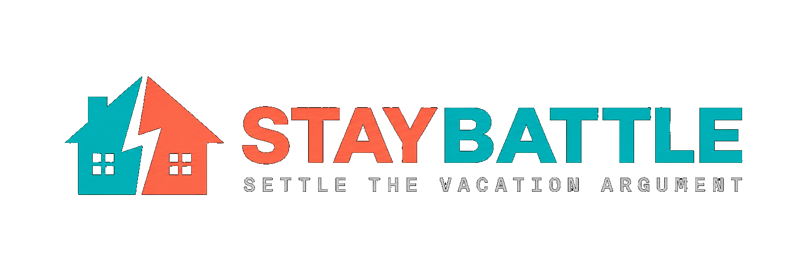
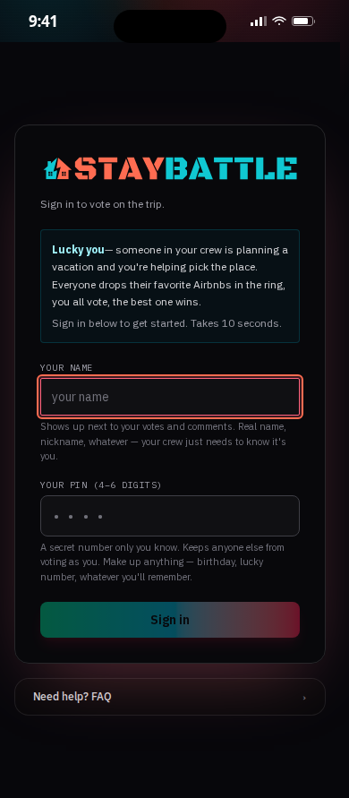

<div align="center">



# StayBattle

**Settle the vacation argument.**
Pit Airbnb listings against each other. Vote, argue in the comments, settle it on the map.

[](https://github.com/datboip/StayBattle/actions/workflows/ci.yml)
[](LICENSE)
[](https://nextjs.org)
[](https://github.com/awesome-selfhosted/awesome-selfhosted)
[](#privacy)

</div>

---

## 60-second install

> ### ⚠️ Before you run anything from this README — read it
>
> This applies to *any* project you find online, not just this one. The commands below pull and run other people's code on your machine.
>
> - **Read [`install.sh`](install.sh) line-by-line.** It's 130 lines, no obfuscation. You should be able to tell exactly what it does in under two minutes. If you can't, don't run it.
> - **Pin a release tag**, not `main`. URLs that say `…/main/install.sh` get whatever's there *right now* — including whatever an attacker might push if the repo gets compromised. Use a tagged version once we ship releases.
> - **Read [`docker-compose.yml`](docker-compose.yml) and [`Dockerfile`](Dockerfile)** before docker-compose-up. Both are short.
> - **`npm install` is not safe-by-default.** The npm ecosystem has had real supply-chain attacks for years and they keep happening, including in the last few weeks:
>   - **[axios (April 2026)](https://www.microsoft.com/en-us/security/blog/2026/04/01/mitigating-the-axios-npm-supply-chain-compromise/)** — a package with ~50M weekly downloads, compromised.
>   - **[TanStack packages](https://snyk.io/blog/tanstack-npm-packages-compromised/)** — the React-ecosystem family (Query, Router, Table) used by huge swaths of frontends.
>   - Older but instructive: `event-stream` (2018), `ua-parser-js` (2021), `node-ipc` (2022), `lottie-player` (2024), plus a steady drip of typosquats.
>
>   Some basics that protect you:
>   - **Use `npm ci`, not `npm install`** in production. `ci` reads `package-lock.json` exactly and refuses to install anything not pinned. `npm install` will happily update versions on you.
>   - **`npm audit`** after install to flag known CVEs. Not exhaustive, but catches the obvious stuff.
>   - **`npm install --ignore-scripts`** skips `postinstall` scripts — that's the main vector for arbitrary code execution at install time. Some packages legitimately need them; if you're paranoid, install with the flag and selectively re-enable scripts for packages you trust.
>   - **Avoid `npm install -g`** unless you really need a global binary. Globals install with broader permissions and stick around forever.
>   - **Be skeptical of brand-new versions** of dependencies you didn't update on purpose. Compromised maintainer accounts publish malicious versions of legit packages. If something updated 2 days ago and now wants to run a postinstall, look at it first.
> - **Same goes for `.env` files and any "paste this command" instruction** anywhere in this repo. If something says "run X", check what X is.
>
> StayBattle is open source under AGPL v3, so you can audit everything. That only helps if you actually look.

```bash
curl -fsSL https://raw.githubusercontent.com/datboip/StayBattle/main/install.sh | sh
```

That's it. Opens at <http://localhost:3000> **on the machine you ran the install on**. Data lives in `~/staybattle/data`.

The installer does exactly four things: check Docker is installed, pull the image, mount a data folder, run the container. Nothing else. No telemetry, no analytics, no remote callbacks.

> ### Letting your crew actually click the link
>
> `localhost:3000` only works on the machine running the container — your crew can't click it unless you make it reachable. Pick one:
>
> - **Same WiFi (easiest)** — find your machine's LAN IP (`ip addr` on Linux · `ipconfig` on Windows · *System Settings → Network* on Mac), then send your crew `http://192.168.x.y:3000`. Works for trips where everyone's at the same house.
> - **From anywhere (recommended)** — expose the port with a tunnel. No port-forwarding, no router config:
>   - **[Cloudflare Tunnel](https://developers.cloudflare.com/cloudflare-one/connections/connect-networks/downloads/)** quick tunnel (free, no signup): `cloudflared tunnel --url http://localhost:3000` → prints a `https://random.trycloudflare.com` URL you send to the crew.
>   - **[ngrok](https://ngrok.com)** (free tier): `ngrok http 3000` → same idea.
>   - **[Tailscale](https://tailscale.com)** if your crew is already on your tailnet — share the machine's tailnet IP.
>   This is how the live demo at <https://app.staybattle.com> works: Docker + a named Cloudflare Tunnel + a domain you own.

<!-- TODO: drop a 10-15 second screencap GIF here once we have one. Show the
flow: name+PIN → set up battle → drop an Airbnb URL → see the fighter card. -->
<!--  -->

## Why this exists

Real talk: my family **cannot** pick a vacation rental. Every single time. Six people, twelve Airbnb candidates, four group texts, zero structure. Someone screenshots one in the chat. Someone else replies "no, this one." Someone DMs you privately "tell them my one was better." After an hour, nobody knows what the actual options are anymore. Trip is soon. Cool.

So I turned the family-vacation-argument into a dope little app.

**Drop every candidate Airbnb URL into one place. Vote together. Comment together. Argue in the open. Settle it on the map.** Real availability check against Airbnb's own booking widget so nobody picks a place that's actually booked. Trophy case at the end so we remember which house won. Done.

You still book on Airbnb. StayBattle is the meeting table, not the storefront.

## What it looks like

<table>
<tr>
<td width="50%"></td>
<td width="50%"></td>
</tr>
<tr>
<td><b>The roster.</b> Every submission ranked by score, with real availability badges, prices, and a one-click path to verify on Airbnb.</td>
<td><b>The battle.</b> Trip dates + invite code + crew list. Organizer can re-check all dates, close the battle, or start fresh.</td>
</tr>
<tr>
<td></td>
<td></td>
</tr>
<tr>
<td><b>The map.</b> Every candidate as a pin, plus reference places (theme parks, restaurants, the wedding venue, whatever). Real OpenStreetMap, no API keys.</td>
<td><b>Mobile-first.</b> Sign-in, voting, comments — all responsive. Your crew uses their phones, this works on their phones.</td>
</tr>
</table>

## What it does

1. **Organizer** sets up a battle: trip name, dates, submission deadline.
2. **Crew joins** with an invite code, each with their own name + PIN.
3. **Submission phase** — everyone pastes Airbnb URLs in. The server grabs photos, location, beds/baths, and rating. Others see only anonymized photos until the deadline — no name-dropping, no bias.
4. **Battle phase** — at the deadline (or when the organizer hits "start now"), everyone can see all submissions. Vote up or down. Leave trash talk. Each submitter's pre-submission "case" sits pinned at the top of the comments.
5. **Swipe-through review** — a one-card-at-a-time mode for going through the pile.
6. **Map** — all listings + any landmarks you pin (resorts, theme parks, dinner spots).

You click through to Airbnb to actually book. StayBattle never replaces that step.

### Identity = name + PIN, no accounts

First time you use a name, you claim it with any 4–6 digit PIN. After that, the same name+PIN on any device signs you into the same identity — your votes follow you. No email signup, no OAuth, no Google login, no nothing. PINs are [scrypt-hashed](SECURITY.md) with a per-voter random salt; rate-limited to 5 attempts/min/name.

## Other ways to install

### Docker Compose (recommended for tinkering)

```bash
git clone https://github.com/datboip/StayBattle.git
cd staybattle
docker compose up -d
```

### From source (recommended for hacking)

```bash
git clone https://github.com/datboip/StayBattle.git
cd staybattle
npm install
npm run dev
```

## Configuration

StayBattle works with zero config. If you want to tweak:

| Env var | Default | Effect |
|---|---|---|
| `STAYBATTLE_PORT` | `3000` | Port for the install script. |
| `STAYBATTLE_DIR`  | `~/staybattle` | Where SQLite + data live. |
| `NEXT_ALLOWED_DEV_ORIGINS` | (unset) | Extra hostnames allowed to hit dev-mode HMR. Private RFC1918 IP ranges already match. |

## Admin? You.

There's no separate admin page because **the person who installs it owns the box**, and the **organizer of each battle owns the battle**. The organizer has everything they need inside the UI:

- Edit battle name, dates, deadline
- Start the battle early (skip waiting for the deadline)
- Generate / regenerate the invite code
- Kick participants
- Reset the whole battle and start fresh

If you ever need server-wide config, edit env vars and re-run the install script. No separate dashboard, no separate login, no separate threat surface.

## Sharing with your crew

The dev server binds to all network interfaces. People on the same Wi-Fi hit `http://<your-lan-ip>:3000`.

For friends off your network:

- **tailscale** — install on each device, share the magic DNS name. Free for personal use, fully private.
- **ngrok** — `npx ngrok http 3000` gives you a public URL. Anyone with it can sign up — protect with the invite code anyway.
- **Small VPS** — see `Dockerfile`. Anything that runs a container works.

## Stack

- **Next.js 16** App Router (Turbopack)
- **React 19**
- **SQLite** via `better-sqlite3`
- **Tailwind 4**
- **Leaflet** + OpenStreetMap (no API key)
- **cheerio** for HTML parsing
- **scrypt** (Node built-in) for PIN hashing
- **Vitest** for tests

## Development

```bash
npm run dev          # start the dev server
npm run typecheck    # tsc --noEmit
npm test             # run the test suite (vitest)
npm run test:watch   # vitest in watch mode
npm run build        # production build
npm start            # serve the production build
```

CI runs typecheck, tests, and build on every push and PR (`.github/workflows/ci.yml`). A separate workflow (`.github/workflows/docker.yml`) builds and publishes the Docker image to GHCR on every push to `main` and on every tag.

## Privacy

StayBattle is built for small private groups:

- No analytics, no tracking pixels, no third-party JavaScript loaded into the page.
- No cookies. Identity lives in your browser's localStorage.
- No telemetry. Next.js telemetry is disabled in the Dockerfile.
- All data is in a single SQLite file. Delete it to nuke everything.

Outbound traffic, in full:

- When a user adds a URL: one HTTP request to `airbnb.com` to fetch the listing page.
- When a user pins a place: one HTTP request to `nominatim.openstreetmap.org` for geocoding.
- When the map is open: tile images from `*.tile.openstreetmap.org`.

That's the entire list.

## Legal

**StayBattle is unaffiliated with Airbnb, Inc.** "Airbnb" is a trademark of Airbnb, Inc.

This project is a **decision-support tool** that helps small groups organize their own discussions about Airbnb listings they're considering. The tool **never replaces Airbnb's booking flow** — every action links you back to Airbnb to actually book. There is no bulk scraping, no discovery / search functionality, no listing aggregation. The server fetches a single page only when a user pastes a URL they already have.

Each user is responsible for their own use of this software with respect to Airbnb's Terms of Service. The software is provided **AS IS, without warranty of any kind**, per AGPL v3.

If you're with Airbnb and want to talk — partnership, licensing, taking this down, anything in between — the maintainer email is in the git log.

## Contributing

StayBattle is **AGPL v3** — see [LICENSE](LICENSE). The spirit:

> *Use it freely. Fork it, run it for your crew, modify it. But if you improve it — share your improvements back. The whole point is that we all benefit from each other's work.*

If you fork it, polish it, deploy it for your group: please open a PR with your improvements, or at least share them publicly under AGPL so others can pick them up. If you want to build something proprietary on top of it that you don't want to AGPL-license, please reach out instead of forking quietly.

See [CONTRIBUTING.md](CONTRIBUTING.md) for the dev workflow and PR checklist.

## License

[GNU Affero General Public License v3.0](LICENSE) © StayBattle contributors.

You can use, modify, and share this freely. If you distribute it or run a modified version as a network service, your modifications must be released under AGPL too. That's the whole rulebook.

---

<div align="center">

*Built one annoyed family vacation at a time.*

**Hope your crew picks the right house.** 🏖️ See you at the beach.

</div>
