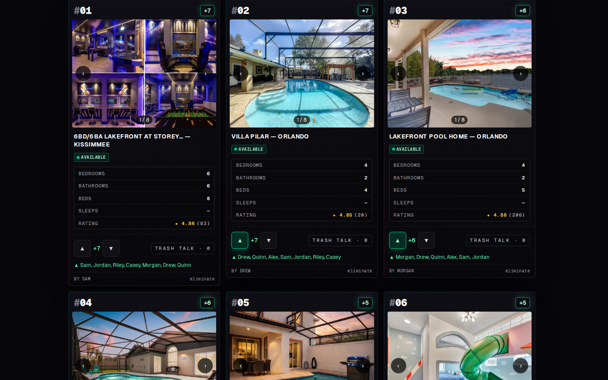
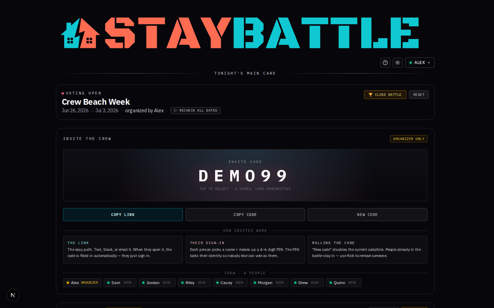
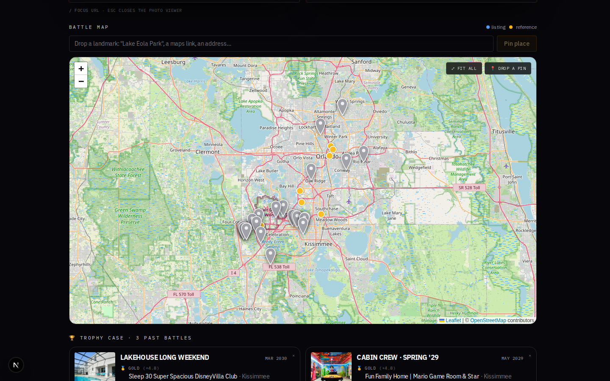
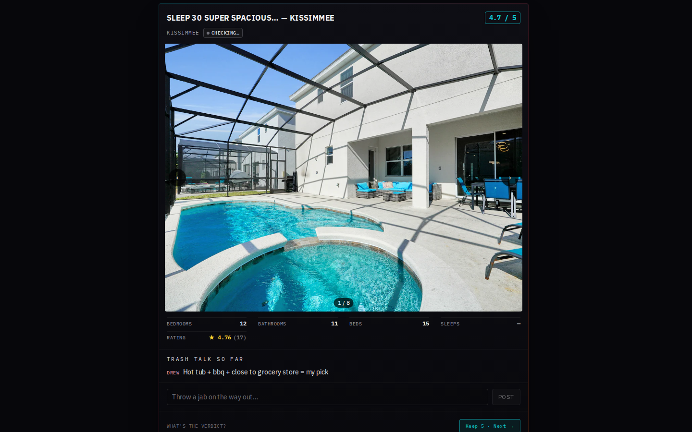
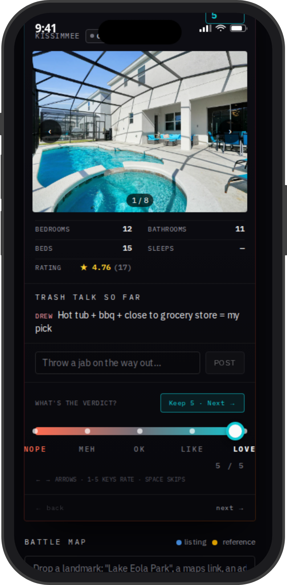
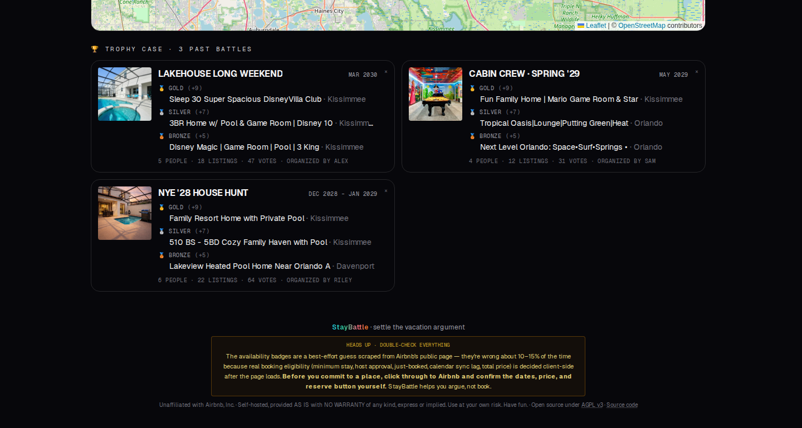

<div align="center">


# StayBattle

**Settle the vacation argument.**
Pit Airbnb listings against each other. Rate, argue in the comments, settle it on the map.

[](https://github.com/datboip/StayBattle/actions/workflows/ci.yml)
[](LICENSE)
[](https://nextjs.org)
[](https://github.com/awesome-selfhosted/awesome-selfhosted)
[](#privacy)

**[🌐 Live demo](https://app.staybattle.com) · [🎨 Brand snapshot](docs/BRAND.md) · [📖 Full brand book](https://staybattle.com/brand) · [🛡 Privacy](PRIVACY.md) · [📜 Terms](TOS.md)**

</div>

---

**StayBattle is a self-hosted, open-source web app where your group drops Airbnb URLs into one place and votes on the winner together.** No accounts, no SaaS, no tracking. You run it on your own box for your own crew.

---

## 🌐 Try the live demo

A public demo runs at **<https://app.staybattle.com>** with pre-seeded
fake data. Anything you do there gets wiped at **04:00 UTC nightly**.

Sign in with any of these demo accounts (PINs are scrypt-hashed
server-side; the modal in the app shows the same list):

| Name   | PIN  | Role      |
|--------|------|-----------|
| Alex   | 1111 | Organizer |
| Sam    | 2222 | Voter     |
| Jordan | 3333 | Voter     |
| Riley  | 4444 | Voter     |
| Casey  | 5555 | Voter     |
| Morgan | 6666 | Voter     |
| Drew   | 7777 | Voter     |
| Quinn  | 8888 | Voter     |

Invite code: `DEMO99`. Sign in as **Alex / 1111** to try the
organizer powers (close the battle, kick voters, edit dates,
set must-haves). Everyone else is a regular voter.

---

## 60-second install

```bash
curl -fsSL https://raw.githubusercontent.com/datboip/StayBattle/main/install.sh | sh
```

That's it. Opens at <http://localhost:3000> **on the machine you ran the install on**. Data lives in `~/staybattle/data`.

> ⚠️ **Pin a release tag**, don't track `main`. The one-liner above grabs whatever's on `main` right now. To pin a known-good version:
> ```bash
> STAYBATTLE_TAG=v0.4.0 sh <(curl -fsSL https://raw.githubusercontent.com/datboip/StayBattle/v0.4.0/install.sh)
> ```

<details>
<summary><strong>📖 Before you curl | sh anything (this or any other project) — click to expand</strong></summary>

This applies to *any* project you find online, not just this one. The command above pulls and runs other people's code on your machine.

- **Read [`install.sh`](install.sh) line-by-line.** It's 130 lines, no obfuscation. You should be able to tell exactly what it does in under two minutes. If you can't, don't run it.
- **Read [`docker-compose.yml`](docker-compose.yml) and [`Dockerfile`](Dockerfile)** before docker-compose-up. Both are short.
- **`npm install` is not safe-by-default.** The npm ecosystem has had real supply-chain attacks for years and they keep happening, including in the last few weeks:
  - **[axios (April 2026)](https://www.microsoft.com/en-us/security/blog/2026/04/01/mitigating-the-axios-npm-supply-chain-compromise/)** — a package with ~50M weekly downloads, compromised.
  - **[TanStack packages](https://snyk.io/blog/tanstack-npm-packages-compromised/)** — the React-ecosystem family (Query, Router, Table) used by huge swaths of frontends.
  - Older but instructive: `event-stream` (2018), `ua-parser-js` (2021), `node-ipc` (2022), `lottie-player` (2024), plus a steady drip of typosquats.

  Some basics that protect you:
  - **Use `npm ci`, not `npm install`** in production. `ci` reads `package-lock.json` exactly and refuses to install anything not pinned. `npm install` will happily update versions on you.
  - **`npm audit`** after install to flag known CVEs. Not exhaustive, but catches the obvious stuff.
  - **`npm install --ignore-scripts`** skips `postinstall` scripts — that's the main vector for arbitrary code execution at install time. Some packages legitimately need them; if you're paranoid, install with the flag and selectively re-enable scripts for packages you trust.
  - **Avoid `npm install -g`** unless you really need a global binary. Globals install with broader permissions and stick around forever.
  - **Be skeptical of brand-new versions** of dependencies you didn't update on purpose. Compromised maintainer accounts publish malicious versions of legit packages. If something updated 2 days ago and now wants to run a postinstall, look at it first.
- **Same goes for `.env` files and any "paste this command" instruction** anywhere in this repo. If something says "run X", check what X is.

StayBattle is open source under AGPL v3, so you can audit everything. That only helps if you actually look.

</details>

The installer does exactly four things: check Docker is installed, pull the image, mount a data folder, run the container. Nothing else. No telemetry, no analytics, no remote callbacks.

> ### Letting your crew actually click the link
>
> `localhost:3000` only works on the machine running the container — your crew can't click it unless you make it reachable. Pick one:
>
> - **Same WiFi (easiest)** — find your machine's LAN IP (`ip addr` on Linux · `ipconfig` on Windows · *System Settings → Network* on Mac), then send your crew `http://192.168.x.y:3000`. Works for trips where everyone's at the same house.
> - **From anywhere (recommended)** — expose the port with a tunnel. No port-forwarding, no router config:
>   - **[Cloudflare Tunnel](https://developers.cloudflare.com/cloudflare-one/connections/connect-networks/downloads/)** quick tunnel (free, no signup): `cloudflared tunnel --url http://localhost:3000` → prints a `https://random.trycloudflare.com` URL you send to the crew.
>   - **[ngrok](https://ngrok.com)** (free tier): `ngrok http 3000` → same idea.
>   - **[Tailscale](https://tailscale.com)** if your crew is already on your tailnet — share the machine's tailnet IP.
>   This is how the live demo at <https://app.staybattle.com> works: Docker + a named Cloudflare Tunnel + a domain you own.

## Why this exists

Real talk: my family **cannot** pick a vacation rental. Every single time. Six people, twelve Airbnb candidates, four group texts, zero structure. Someone screenshots one in the chat. Someone else replies "no, this one." Someone DMs you privately "tell them my one was better." After an hour, nobody knows what the actual options are anymore. Trip is soon. Cool.

So I turned the family-vacation-argument into a dope little app.

**Drop every candidate Airbnb URL into one place. Rate together. Comment together. Argue in the open. Settle it on the map.** Real availability check against Airbnb's own booking widget so nobody picks a place that's actually booked. Trophy case at the end so we remember which house won. Done.

You still book on Airbnb. StayBattle is the meeting table, not the storefront.

## What it looks like

<table>
<tr>
<td width="50%"></td>
<td width="50%"></td>
</tr>
<tr>
<td><b>The roster.</b> Every submission ranked by mean rating, with status-colored availability badges, prices, must-haves checklist, "Nearby" drive-time pills to your pinned places, and a one-click path to verify on Airbnb. Booked listings get a full-card <code>BOOKED</code> rubber stamp.</td>
<td><b>The battle.</b> Trip dates + invite code + crew list. Organizer can re-check all dates, set must-have amenities, close the battle, or start fresh.</td>
</tr>
<tr>
<td></td>
<td></td>
</tr>
<tr>
<td><b>The map.</b> Every candidate as a status-colored teardrop (teal=available, rose-with-✕=booked, amber=unknown). Drop reference pins for theme parks, restaurants, airports, the wedding venue — categorized so the map color-codes them, with filter chips to hide categories. OpenStreetMap tiles, no API keys.</td>
<td><b>Swipe-through review.</b> One-card-at-a-time mode. Big slider with the Nope · Meh · OK · Like · Love labels. Keyboard shortcuts (1–5 set the rating, ← / → navigate, Esc bails) on a laptop, swipe on a phone.</td>
</tr>
<tr>
<td></td>
<td></td>
</tr>
<tr>
<td><b>Mobile-first.</b> Sign-in, voting, comments, drop-pin, swipe-review — all responsive. Your crew uses their phones, this works on their phones.</td>
<td><b>Trophy case.</b> Past battles get archived as gold/silver/bronze podiums. Dates round to month-only and the clickable Airbnb URL is stripped on archive — the case is a memento, not a permanent doxxing surface.</td>
</tr>
</table>

## What it does

1. **Organizer** sets up a battle: trip name, dates, submission deadline, optional **must-have amenities** (wifi, pool, parking, etc.).
2. **Crew joins** with an invite code, each with their own name + PIN.
3. **Submission phase** — everyone pastes Airbnb URLs in. The server grabs photos, location, beds/baths, rating, and amenity tags from Airbnb's own GraphQL endpoint. Others see only anonymized photos until the deadline — no name-dropping, no bias.
4. **Battle phase** — at the deadline (or when the organizer hits "start now"), everyone can see all submissions. Rate each one **1–5** on a slider (Nope · Meh · OK · Like · Love). Leave trash talk. Each submitter's pre-submission "case" sits pinned at the top of the comments. **You can't rate your own submission** — no ballot stuffing.
5. **Swipe-through review** — a one-card-at-a-time mode for going through the pile; drag the slider to rate, swipe direction follows the score.
6. **Map** — every candidate as a status-colored teardrop pin. Anyone can drop a categorized reference pin (theme parks, restaurants, airports, etc.) — no geocoding needed, click the map. Filter chips toggle categories on/off. Each listing card shows real OSRM-routed **drive times** to the 3 closest pinned places.
7. **Close + archive** — organizer closes the battle. Top 3 (with ties grouped as co-medalists) get archived to the trophy case with month-rounded dates and scrubbed URLs. Past battles persist across sessions so trip #2 remembers what won trip #1.

You click through to Airbnb to actually book. StayBattle never replaces that step.

### Identity = name + PIN, no accounts

First time you use a name, you claim it with any 4–6 digit PIN. After that, the same name+PIN on any device signs you into the same identity — your ratings follow you. No email signup, no OAuth, no Google login, no nothing. PINs are [scrypt-hashed](SECURITY.md) (N=16384) with a per-voter random salt; rate-limited to 5 attempts/min/name.

### Self-host vs. live demo

| | Live demo at <app.staybattle.com> | Self-hosted |
|---|---|---|
| **Data persistence** | Wiped nightly at 04:00 UTC | Forever (it's your SQLite file) |
| **Airbnb scraping** | Pre-baked statuses (demo mode) | Real GraphQL availability check |
| **Sign-in** | Use the 8 demo accounts above | Anyone with the URL claims a name |
| **Cost** | Free, no signup | Free, no signup, your hardware |
| **Best for** | Kicking the tires | Actual trip planning |

## Other ways to install

### Docker Compose (recommended for tinkering)

```bash
git clone https://github.com/datboip/StayBattle.git
cd staybattle
docker compose up -d
```

### From source (recommended for hacking)

```bash
git clone https://github.com/datboip/StayBattle.git
cd staybattle
npm install
npm run dev
```

## Configuration

StayBattle works with zero config. If you want to tweak:

| Env var | Default | Effect |
|---|---|---|
| `STAYBATTLE_PORT` | `3000` | Port for the install script. |
| `STAYBATTLE_DIR`  | `~/staybattle` | Where SQLite + data live. |
| `STAYBATTLE_DB_DIR` | `./data` | Where the SQLite DB lives (production override). |
| `STAYBATTLE_DEMO_MODE` | (unset) | When `true`: skip Airbnb GraphQL availability calls, use pre-baked statuses (avoids rate-limiting). Used by the public demo. |
| `STAYBATTLE_OSRM_URL` | `https://router.project-osrm.org` | OSRM server for drive-time routing on the "Nearby" pills. Point at a self-hosted OSRM when traffic outgrows the public demo. |
| `NEXT_ALLOWED_DEV_ORIGINS` | (unset) | Extra hostnames allowed to hit dev-mode HMR. Private RFC1918 IP ranges already match. |

## Admin? You.

There's no separate admin page because **the person who installs it owns the box**, and the **organizer of each battle owns the battle**. The organizer has everything they need inside the UI:

- Edit battle name, dates, deadline, must-have amenities
- Start the battle early (skip waiting for the deadline)
- Generate / regenerate the invite code
- Force-recheck availability for all listings
- Kick participants (with or without removing their votes)
- Override a stale availability status with a note
- Close + archive the battle to the trophy case
- Reset the whole battle and start fresh

Instance operators (whoever runs the box) also have a one-line CLI for DMCA takedowns: `node scripts/admin/remove-url.mjs <url> "<reason>"` — see [SECURITY.md](SECURITY.md#takedown-requests-dmca-host-opt-out-other).

If you ever need server-wide config, edit env vars and re-run the install script. No separate dashboard, no separate login, no separate threat surface.

## Sharing with your crew

The dev server binds to all network interfaces. People on the same Wi-Fi hit `http://<your-lan-ip>:3000`.

For friends off your network:

- **tailscale** — install on each device, share the magic DNS name. Free for personal use, fully private.
- **ngrok** — `npx ngrok http 3000` gives you a public URL. Anyone with it can sign up — protect with the invite code anyway.
- **Small VPS** — see `Dockerfile`. Anything that runs a container works.

Invite links use a URL fragment (`#invite=ABCDEF`) so the code never reaches server logs — your nginx access log can't accidentally retain the invite when someone clicks the link.

## Stack

- **Next.js 16** App Router (Turbopack)
- **React 19**
- **SQLite** via `better-sqlite3`
- **Tailwind 4**
- **Leaflet** + OpenStreetMap (no API key)
- **OSRM** (`router.project-osrm.org` by default, configurable) for drive-time routing
- **cheerio** for HTML parsing
- **scrypt** (Node built-in) for PIN hashing
- **Vitest** for tests (144 covering rank, podium, distance, routing, requirements, place-dedup, geocode, scrape, validate, auth, battle, trip, title, invite, rate-limit, availability)

## Development

```bash
npm run dev          # start the dev server
npm run typecheck    # tsc --noEmit
npm test             # run the test suite (vitest)
npm run test:watch   # vitest in watch mode
npm run build        # production build
npm start            # serve the production build
```

CI runs typecheck, tests, and build on every push and PR (`.github/workflows/ci.yml`). A separate workflow (`.github/workflows/docker.yml`) builds and publishes the Docker image to GHCR on every push to `main` and on every tag.

### Regenerating screenshots

The README's screenshots all live in [`docs/screenshots/`](docs/screenshots/) and are committed to git. To regenerate them:

```bash
# 1. Build a clean demo DB from the real DB's listings + fake social data
node scripts/screenshots/seed-demo.mjs

# 2. Spin up a second dev server pointed at the demo DB
STAYBATTLE_DB_DIR=./data-demo STAYBATTLE_DEMO_MODE=true npx next dev --port 3001

# 3. Capture screenshots (in another terminal)
BASE_URL=http://localhost:3001 \
  DEMO_VOTER_ID=$(sqlite3 data-demo/quickie.db "select id from voters where name='Alex'") \
  DEMO_VOTER_NAME=Alex \
  node scripts/screenshots/capture.mjs
```

The capture script also bakes phone-frame mockups (`iphone-review-mode.png`, `pixel-review-mode.png`) by wrapping the mobile screenshots in an SVG iPhone / Pixel frame + iOS-style status bar at the top.

## Privacy

StayBattle is built for small private groups. See [PRIVACY.md](PRIVACY.md) for the full threat model + what's still soft.

- No analytics, no tracking pixels, no third-party JavaScript loaded into the page.
- **One cookie**: a same-site `staybattle_voter` cookie set on sign-in so the server-side gate can tell whether to render battle data (added 2026-05-27 to close a leak where anonymous visitors could `curl` the page and get the invite code + every comment). Mirrored to `localStorage` for the client UI. Cleared on sign-out. Not third-party. Not analytics.
- **Invite codes ride in the URL fragment** (`#invite=…`), not the query string — fragments never reach the server, so nginx access logs / Cloudflare logs / browser referer headers never capture them.
- **nginx logs use a scrubbed format** that drops query strings entirely (belt-and-suspenders against the above).
- **Past-battle archives are date-scrubbed** to month/year and have the clickable Airbnb URL stripped — the trophy case can't pinpoint "the crew was at this exact rental from <day> to <day>" after the trip.
- No telemetry. Next.js telemetry is disabled in the Dockerfile.
- All data is in a single SQLite file. Delete it to nuke everything.

Outbound traffic, in full:

- When a user adds a URL: one HTTP request to `airbnb.com` to fetch the listing page (skipped in `STAYBATTLE_DEMO_MODE=true`).
- When a user pins a place via address (drop-pin works without this): one HTTP request to `nominatim.openstreetmap.org` for geocoding.
- When a battle has reference places + listings with coordinates: one HTTP request to OSRM (`router.project-osrm.org` by default) per SSR to compute drive-time pills.
- When the map is open: tile images from `*.tile.openstreetmap.org`.

That's the entire list.

## Legal

**StayBattle is unaffiliated with Airbnb, Inc.** "Airbnb" is a trademark of Airbnb, Inc.

This project is a **decision-support tool** that helps small groups organize their own discussions about Airbnb listings they're considering. The tool **never replaces Airbnb's booking flow** — every action links you back to Airbnb to actually book. There is no bulk scraping, no discovery / search functionality, no listing aggregation. The server fetches a single page only when a user pastes a URL they already have.

Each user is responsible for their own use of this software with respect to Airbnb's Terms of Service. The software is provided **AS IS, without warranty of any kind**, per AGPL v3.

Terms of service for users of the live demo at app.staybattle.com are in [TOS.md](TOS.md). Privacy practices are in [PRIVACY.md](PRIVACY.md). Security policy + DMCA takedown procedure are in [SECURITY.md](SECURITY.md).

If you're with Airbnb and want to talk — partnership, licensing, or anything in between — the maintainer email is in the git log, and formal takedown requests go through the channel documented in [SECURITY.md](SECURITY.md).

## Contributing

StayBattle is **AGPL v3** — see [LICENSE](LICENSE). The spirit:

> *Use it freely. Fork it, run it for your crew, modify it. But if you improve it — share your improvements back. The whole point is that we all benefit from each other's work.*

If you fork it, polish it, deploy it for your group: please open a PR with your improvements, or at least share them publicly under AGPL so others can pick them up. If you want to build something proprietary on top of it that you don't want to AGPL-license, please reach out instead of forking quietly.

See [CONTRIBUTING.md](CONTRIBUTING.md) for the dev workflow and PR checklist.

## License

[GNU Affero General Public License v3.0](LICENSE) © StayBattle contributors.

You can use, modify, and share this freely. If you distribute it or run a modified version as a network service, your modifications must be released under AGPL too. That's the whole rulebook.

---

<div align="center">

*Built one annoyed family vacation at a time.*

**Hope your crew picks the right house.** 🏖️ See you at the beach.

</div>
