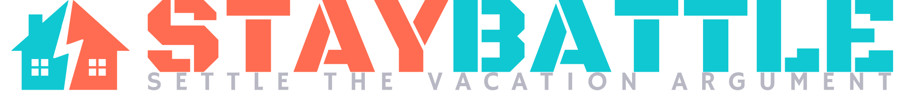
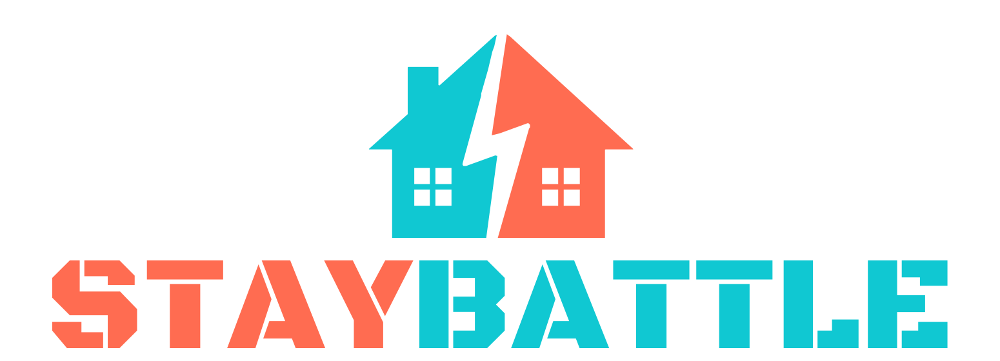
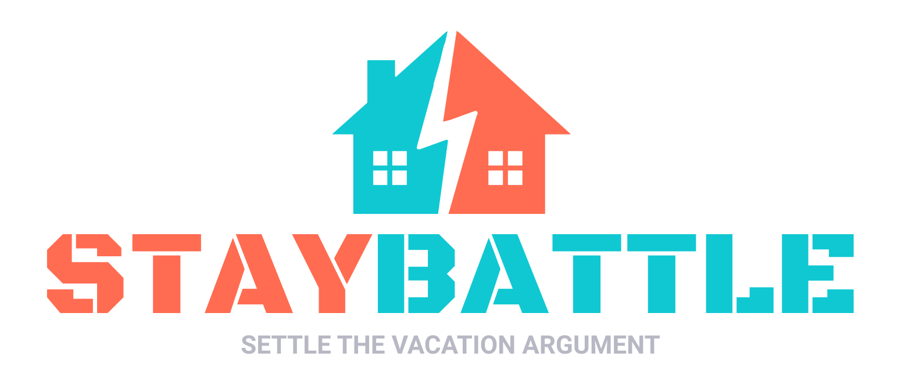
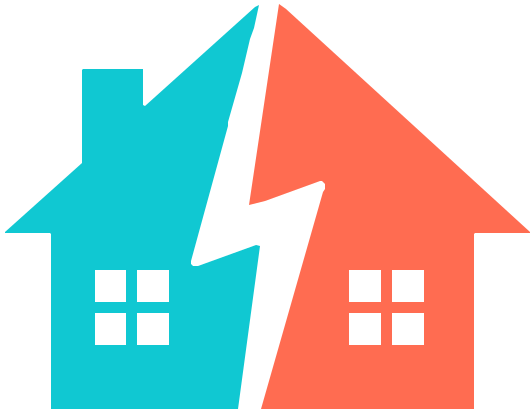

# StayBattle brand snapshot

> **Quick visual reference.** For the full brand book — type ramps,
> usage examples, do's and don'ts, downloadable wordmark variants —
> visit **[staybattle.com/brand](https://staybattle.com/brand)**.

---

## Wordmarks

| | |
|---|---|
|  | `staybattle-main.svg` — primary wordmark, no tagline. |
|  | `staybattle-main-tagline.svg` — primary with "Settle the vacation argument" tagline. |
|  | `logo-banner.svg` — banner lockup, wide aspect (used in the app header). |
|  | `logo-banner-tagline.svg` — banner with tagline. |
|  | `icon.svg` — favicon / app icon, square. |

All wordmarks ship as **SVG** in [`public/`](../public/). The
wordmark is the Black Ops One typeface — **never** load it as a
webfont. The marks are pre-rendered SVGs precisely so the
typography stays consistent without taking a font dependency.

---

## Color palette

The full canonical palette lives at
[staybattle.com/brand](https://staybattle.com/brand). Three core
tokens are reused everywhere in the app:

| Token | Hex | Role |
|---|---|---|
|  **Brand teal** | `#10C8D2` | Positive state: high ratings (Love), available listings, primary accents, "Got It" buttons. |
|  **Brand rose** | `#FF6C51` | Negative / energetic state: low ratings (Nope), the BOOKED stamp, destructive action buttons, the brand's "fight night" energy. |
|  **Brand amber** | `#fbbf24` | Caution / pending state: drop-pin mode toggle, the "double-check on Airbnb" disclaimer banner, unknown-availability badges. |

The two gradient anchors `linear-gradient(teal → rose)` are the
brand's signature — used on the hero call-to-action, the rating
slider track, and the bottom border of the demo modal.

Background neutrals are dark by default (`#07070b` page,
`#18181b` card surfaces). Light-mode is a warm-white reskin with
brand colors preserved at the same hexes.

---

## Typography

| Family | Use |
|---|---|
| **Black Ops One** (display) | Wordmark only. SVG-rendered, never loaded as a webfont. |
| **IBM Plex Sans** | Body, headings, UI labels. Loaded via `next/font/google` in [`src/app/layout.tsx`](../src/app/layout.tsx). |
| **IBM Plex Mono** | Numerals, codes (`DEMO99`), keyboard hints, anything that wants to read as data. Same import path. |

The variable fonts are exposed as CSS custom properties
`--font-plex-sans` / `--font-plex-mono` and applied via Tailwind's
default font-family layer.

---

## In context

How the brand actually shows up in the running app:

| | |
|---|---|
|  | **Roster view.** Teal accents on high-rated listings, rose accents on low ones, the gradient on the active slider thumb. |
|  | **Review mode.** Big slider with the full Nope · Meh · OK · Like · Love label set; the gradient track and white thumb are the brand's most visible UI moment. |
|  | **Map.** Status-colored teardrops (teal / rose / amber) for listings, category-colored dots for reference places. |
|  | **Mobile.** Same UI, fits in your pocket. |

---

## Voice

- **Conversational, slightly profane.** Not corporate. "Settle the
  vacation argument", not "facilitate group consensus on rental
  selection."
- **Self-aware.** It's a tool for an argument with your siblings,
  not a SaaS pitch. Punchlines are good.
- **Concise.** Short sentences. Hard claims with caveats where the
  claim isn't 100% (e.g. availability badges: "wrong about 10–15%
  of the time"). No marketing-speak.
- **Anti-pretentious.** "Drop every candidate Airbnb URL into one
  place" not "Create a centralized aggregation surface for
  candidate accommodations."

---

## Where the full brand book lives

The interactive brand book with color usage rules, typography
ramps, wordmark spacing/clearspace, do's and don'ts, and
downloadable assets is at:

**🎨 [staybattle.com/brand](https://staybattle.com/brand)**

Source for that page lives in
[`datboip/staybattle-site`](https://github.com/datboip/staybattle-site)
under `brand/index.html`.
